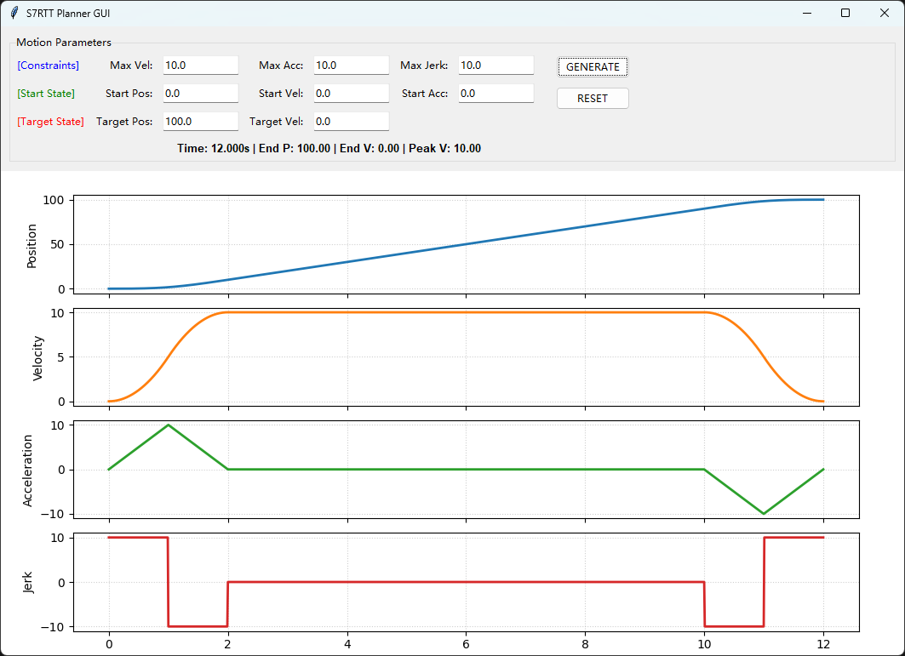
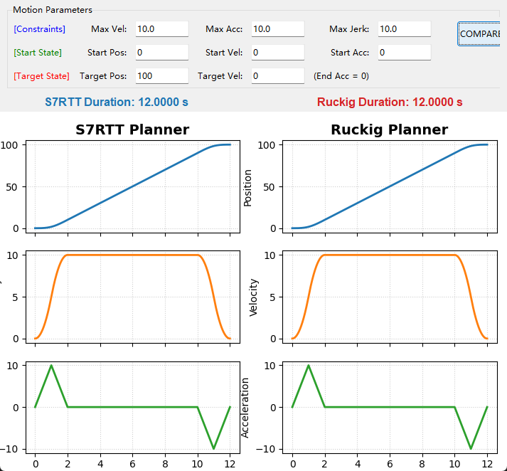
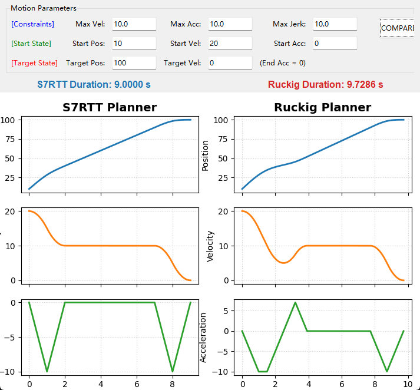
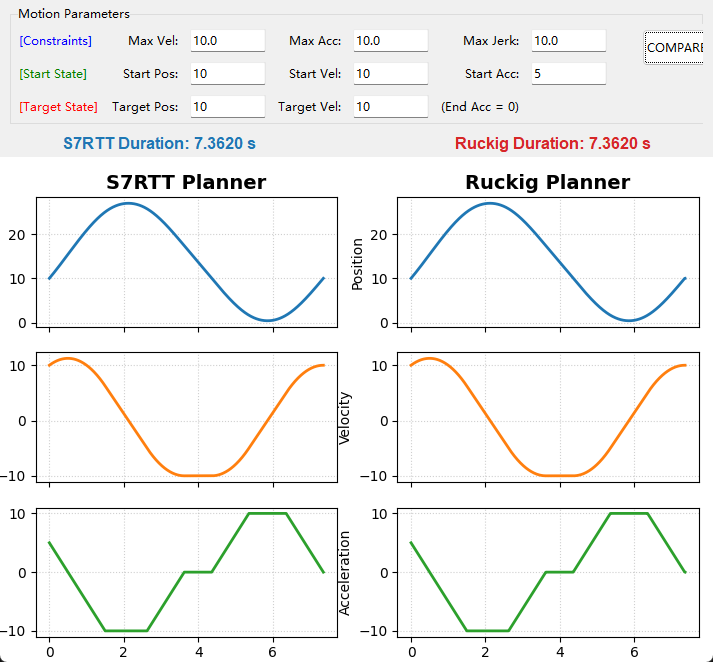
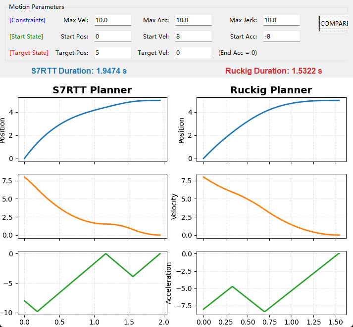
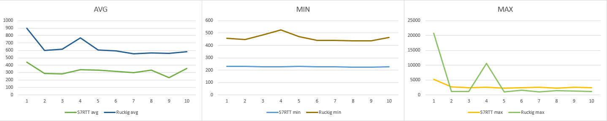

# S7RTT (Simple 7seg Real-Time Trajectory Generator)

**S7RTT** is a lightweight, high-performance C++/C/Python/ST library designed for generating **7-segment S-curve motion profiles** (jerk-limited trajectories).

While conceptually similar to the renowned [Ruckig](https://github.com/pantor/ruckig) library, S7RTT is specifically optimized for **single-axis applications**, offering a streamlined alternative for embedded systems and real-time control loops where low latency and deterministic execution are paramount.



## 🚀 Key Features

S7RTT provides a robust solution for time-optimal trajectory generation with the following capabilities:

*   **Arbitrary Initial State:** Calculate trajectories starting from any position, velocity, and acceleration.
*   **Target State Control:** Reach any desired target position and velocity.
    *   *Note: The target acceleration is fixed at `0` and cannot be modified in the current version.*
*   **Full Jerk Constraints:** Implements complete jerk limitation to ensure smooth, third-order continuous motion, reducing mechanical stress.
*   **Real-Time Interruption:** Supports "online" trajectory generation. You can interrupt the motion at any time with new target parameters, and the library will calculate a smooth transition from the current kinematic state.

## ⚖️ Comparison with Ruckig

S7RTT is not intended to replace Ruckig for multi-DOF or complex non-zero target acceleration cases, but it offers distinct advantages in specific single-axis scenarios:

1.  **Standard Trajectories:** For normal point-to-point moves, calculation results are consistent with Ruckig.  

2.  **Velocity Limits:** S7RTT demonstrates superior trajectory optimization when handling cases where the maximum velocity limit is dynamically lowered or constrained.  

3.  **Boundary Conditions:**
    *   In many edge cases, performance is comparable.  

    *   Ruckig currently maintains an edge in robustness regarding specific complex mathematical boundary singularities.  

    *   However, in random number tests, Ruckig's robustness and the number of optimal solutions are far inferior to S7RTT.
```
################################################################################
FINAL STATISTICS (With Simulation Verification)
################################################################################
Total Tests         : 10000
----------------------------------------
S7RTT Failures:
  - Plan Crash/Empty: 0
  - Accuracy check  : 0
----------------------------------------
Ruckig Failures:
  - Plan Error      : 779
  - Accuracy check  : 0
----------------------------------------
Comparisons:
  - S7 Faster       : 708 (Optimizations)
  - Mismatches      : 4 (S7 Slower/Failed)
################################################################################
```
   

## ⚡ Performance

Benchmarks conducted on C++ platforms highlight the efficiency of S7RTT:

*   **Faster Computation:** S7RTT requires significantly less CPU time per calculation cycle compared to Ruckig.
*   **Lower Jitter:** The calculation time is more deterministic with lower variance (jitter), making it highly suitable for hard real-time systems where timing budgets are strict.

(Measure cycle time compare chart, The unit is nanoseconds)


## 📝 Summary & Acknowledgements

S7RTT aims to provide a simple, fast, and reliable trajectory generator for single-axis motion control tasks. By simplifying the problem space (fixing target acceleration to zero), it achieves extremely high performance and code simplicity.

### Acknowledgements

Special thanks to **Gemini 3 Pro** for the assistance in the development and optimization of this library.


