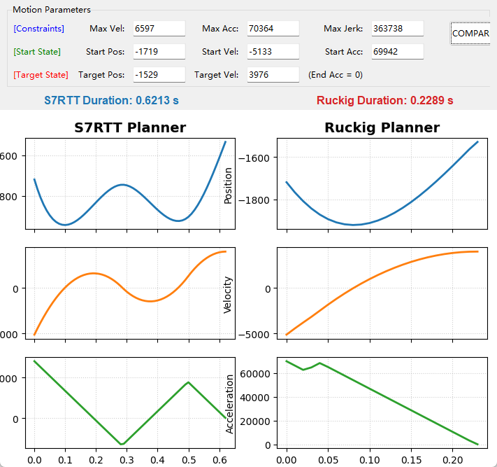
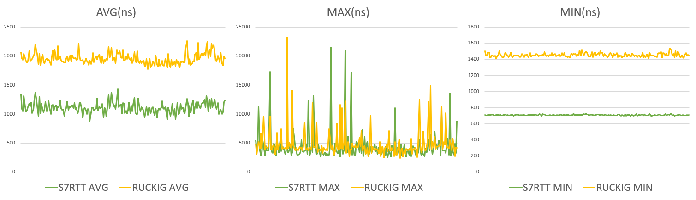

# S7RTT (Simple 7seg Real-Time Trajectory Generator)

**S7RTT** is a lightweight, high-performance C++/C/Python/ST library designed for generating **7-segment S-curve motion profiles** (jerk-limited trajectories).

While conceptually similar to the renowned [Ruckig](https://github.com/pantor/ruckig) library, S7RTT is specifically optimized for **single-axis applications**, offering a streamlined alternative for embedded systems and real-time control loops where low latency and deterministic execution are paramount.


## 🚀 Key Features

S7RTT provides a robust solution for time-optimal trajectory generation with the following capabilities:

*   **Arbitrary Initial State:** Calculate trajectories starting from any position, velocity, and acceleration.
*   **Target State Control:** Reach any desired target position and velocity.
    *   *Note: The target acceleration is fixed at `0` and cannot be modified.*
*   **Full Jerk Constraints:** Implements complete jerk limitation to ensure smooth, third-order continuous motion, reducing mechanical stress.
*   **Real-Time Interruption:** Supports "online" trajectory generation. You can interrupt the motion at any time with new target parameters, and the library will calculate a smooth transition from the current kinematic state.

## ⚖️ Comparison with Ruckig

S7RTT is not intended to replace Ruckig for multi-DOF cases, but it offers distinct advantages in single-axis scenarios:

1.  **Standard Trajectories:** For normal point-to-point moves, calculation results are consistent with Ruckig.  

2.  **Velocity Limits:** S7RTT demonstrates superior trajectory optimization when handling cases where the maximum velocity limit is dynamically lowered or constrained.  

3.  **Boundary Conditions:**
    *   In many edge cases, performance is comparable.  

    *   Ruckig does exhibit better solutions under certain boundary conditions.  

    *   However, more often than not, even within the constraints, Ruckig still attempts to insert a Brake motion, which leads to a suboptimal final solution.  

    *   Specifically, Ruckig recommends using "m" as the unit. If you use "mm" with a large jerk, planning failures will occur frequently, while S7RTT recommends using "mm" as the unit. Below is a comparison of scaled random stress tests in normal operation:  
```
################################################################################
FINAL STATISTICS
################################################################################
Total Tests: 100000
----------------------------------------
CATEGORY             | S7RTT      | RUCKIG
----------------------------------------
Plan Failures        | 0          | 0
Sim Acc Failures     | 0          | 0
----------------------------------------
Faster Count         | 6356       | 5
Draws                | 93639      | 93639
################################################################################
```

    *   Below are comparisons of some random extreme cases:  
```
################################################################################
FINAL STATISTICS
################################################################################
Total Tests: 100000
----------------------------------------
CATEGORY             | S7RTT      | RUCKIG
----------------------------------------
Plan Failures        | 0          | 169
Sim Acc Failures     | 23         | 192
----------------------------------------
Faster Count         | 418        | 91
Draws                | 99130      | 99130
################################################################################
```
   

## ⚡ Performance

Benchmarks conducted on C++ platforms evaluate the performance of S7RTT compared to Ruckig:

*   **Reduced Average Load:** S7RTT reduces the average CPU time per calculation cycle by approximately 30%, improving overall computational efficiency.
*   **Comparable Real-Time Limits:** Despite the lower average, the maximum execution time (peak latency) remains similar to Ruckig. This indicates that for hard real-time constraints (worst-case scenarios), the practical performance envelope is equivalent.

(Measure cycle time compare in Preempt_RT Linux, The unit is nanoseconds)


## ⚙️ Underlying Algorithms

The core challenge of S-curve generation is calculating a **time-optimal trajectory** from an **arbitrary initial state** ($P_0, V_0, A_0 \neq 0$) to a target state. Since motion can be interrupted at any moment, the solver must handle non-zero initial acceleration without simply forcing it to zero first.

S7RTT differentiates itself from other solvers through its numerical approach:

1.  **Analytical Complexity:**
    Libraries like Ruckig or TwinCAT typically solve cubic or quartic equations (using Cardano, Ferrari, or Newton methods) for exact roots. However, at specific boundary conditions—particularly when the target velocity is non-zero—these analytical methods can hit singularities. This often forces a fallback to bisection search.

2.  **Brent’s Method & Heuristics:**
    Instead of relying solely on analytical root-finding, S7RTT employs **trajectory extrapolation combined with Brent’s method** for iterative approximation.
    *   This "fuzzy solving" approach prioritizes convergence stability over absolute theoretical precision.
    *   If a time-optimal solution cannot be found numerically, the algorithm safely degrades to a strategy of "reducing acceleration to zero before planning," ensuring a valid solution exists.

3.  **Usage Recommendations:**
    To maximize performance, the algorithm is designed for a **"Plan Once, Sample Many"** workflow. Users are advised to call `plan()` only when the target changes, and use `at_time()` for per-cycle updates, rather than re-planning every cycle. However, immediate interruption with new parameters is fully supported.

## 📝 Summary & Acknowledgements

S7RTT aims to provide a simple, fast, and reliable trajectory generator for single-axis motion control tasks. By simplifying the problem space (fixing target acceleration to zero), it achieves extremely high performance and code simplicity.

### Acknowledgements

Special thanks to **Gemini 3 Pro** for the assistance in the development and optimization of this library.


